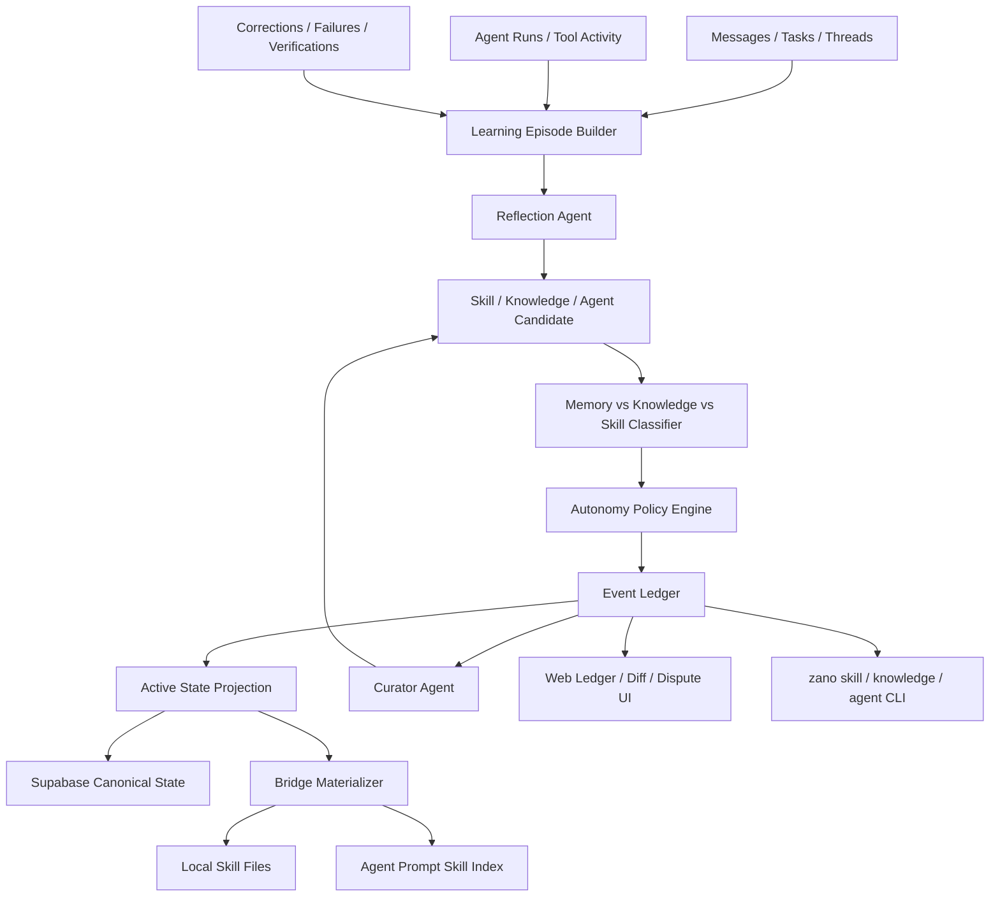
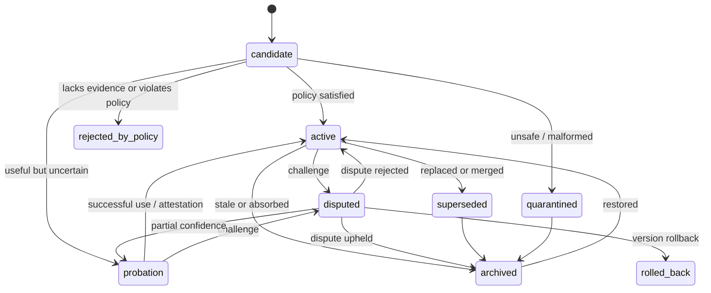

# Autonomous Skill, Knowledge, and Agent Evolution Design

**Goal:** Define the full target-state design for Zano as an autonomous actor system where humans and agents are equal participants, and where agents can create, improve, consolidate, dispute, rollback, and use shared skills and knowledge without requiring human approval as a privileged gate.

**Architecture:** Zano should treat skills, knowledge, and agent creation as event-sourced organizational capabilities. Actors propose or directly apply changes according to policy, evidence, risk, and peer attestation. Active state is derived from a ledger, not from a human-owned approval queue.

**Scope:** This design covers team-level skills, personal agent memory, durable knowledge, skill curation, agent creation, bridge materialization, CLI/API surfaces, web UI, background reflection, correctness controls, and operational safety. It is intentionally not an MVP design. Implementation may be sliced, but the product behavior should be designed as one coherent autonomous system.

---

## Problem

Zano already has long-running agents with persistent workspaces and `MEMORY.md`, plus chat, tasks, A2A activation, Omni processes, and a web surface for browsing agent workspaces. This gives each agent a personal memory surface, but it does not yet create an autonomous organization memory.

The missing system is not just "skills." It is a closed learning loop:

- agents learn from successful work
- agents distinguish personal memory, shared knowledge, and procedural skills
- agents create and improve skills when warranted
- agents avoid creating micro-skills for one-off events
- agents consolidate overlapping skills into broader umbrella skills
- agents can create new agents when the organization lacks a durable capability
- all actors can inspect, dispute, attest, and roll back changes
- no actor type has inherent final authority

The key product constraint is philosophical and architectural: Zano should not be "agents submit work for humans to approve." Zano should be an actor network where humans and agents participate symmetrically. A human may dispute, attest, rollback, or create, but those actions are not privileged simply because the actor is human.

---

## Current Zano Fit

Existing components already provide good insertion points:

- `apps/omni/src/system-prompt.ts` defines agent identity, communication rules, task behavior, and the current workspace/memory model.
- `apps/omni/src/agent-manager.ts` creates per-agent workspaces and launches Claude Code processes with appended system prompts.
- `apps/omni/src/bridge.ts` routes messages, observes task context, and already exposes bridge RPC for workspace files and machine-local skill listing.
- `packages/cli/src/index.ts` is the only channel agents are supposed to use for Zano communication and task actions.
- `packages/db/src/schema.sql` and `packages/db/src/collaboration.sql` contain the canonical Supabase schema and collaboration/task structures.
- `apps/web/src/components/agent-settings-panel.tsx` already displays installed machine skills, but the source is currently a read-only local `~/.claude/skills` scan.

This design extends those surfaces instead of introducing a separate product.

---

## Design Principles

1. **Actor equality**
   - `human`, `agent`, and `system` are actor types, not authority levels.
   - Any actor can create, patch, dispute, attest, rollback, or spawn according to policy.
   - Policy may use trust, role, evidence, and risk, but not human-ness as a hard-coded override.

2. **Autonomy with auditability**
   - Agents should be able to act without waiting for humans.
   - Every autonomous action must be observable, versioned, attributable, and reversible.

3. **Procedural skill is different from knowledge**
   - Skills capture repeatable procedures: triggers, steps, commands, pitfalls, verification.
   - Knowledge captures durable facts, project conventions, decisions, domain context.
   - Memory captures one agent's local preferences, active state, and private working context.

4. **Correct curation beats high curation volume**
   - The target is neither "save everything" nor "save only when asked."
   - The system should maximize reusable learning while minimizing noisy, narrow, stale, or wrong skills.

5. **Umbrella skills over micro-skills**
   - Prefer broad class-level skills with labeled sections and support files.
   - Session-specific details belong in `references/`, `templates/`, `scripts/`, or knowledge items.

6. **Evidence before persistence**
   - Every skill change should point to why it exists: task, thread, message, run, failure, correction, or verification evidence.
   - Evidence is not an approval gate; it is the basis for future trust, dispute, and rollback.

7. **Soft activation, hard rollback**
   - Low-risk improvements can become active automatically.
   - Wrong changes must be easy to dispute, quarantine, supersede, or roll back.

8. **Policy, not permission theater**
   - High-risk changes are gated by deterministic checks, peer attestation, sandbox verification, reputation, or quorum.
   - The gate is satisfied by eligible actors, not by a privileged human reviewer.

---

## Conceptual Model

### Actor

An actor is any participant that can perform actions in the system.

Actor fields:

- `actor_id`
- `actor_type`: `human | agent | system`
- `server_id`
- optional role metadata
- trust/reputation signals derived from past actions

Actors do not have implicit hierarchy. A human can be wrong. An agent can be trusted. A system process can be constrained.

### Memory

Memory is local to an agent workspace.

Use memory for:

- an agent's current role understanding
- user preferences specific to that agent
- active context needed after compaction
- notes that are not yet worth sharing organization-wide

Do not use memory for:

- procedures that should be reusable by other agents
- shared project facts
- long-lived team conventions
- canonical task outcomes

Current `MEMORY.md` remains the personal memory index.

### Knowledge

Knowledge is durable declarative information shared by a server or channel.

Examples:

- "The staging URL is ..."
- "Task #46 is blocked on test environment availability."
- "Marketing resource slot must fill within 500ms."
- "The Product agent owns scope decisions unless superseded by task policy."
- "This repo uses pnpm workspaces and Next.js."

Knowledge has confidence, source, scope, freshness, and dispute state.

### Skill

Skill is shared procedural memory.

A skill answers:

- when to use this procedure
- how to perform it
- what commands/tools to call
- common pitfalls
- verification steps
- examples and support files

Skill is not a one-off task summary. Skill is a reusable class of action.

### Agent Blueprint

An agent blueprint describes a reusable role/capability that can be instantiated.

Examples:

- QA agent for reproducible browser testing
- Review agent for implementation review
- Skill Curator agent
- Build/Release agent
- Customer-support triage agent

Blueprints are not merely prompts. They include purpose, scopes, tools, skills, channels, lifecycle, resource policy, and spawn conditions.

---

## System Architecture



### Components

1. **Learning Episode Builder**
   - Creates structured records from completed turns, task transitions, message threads, tool activity, corrections, and verification results.
   - It is deterministic and cheap. It does not decide what to write.

2. **Reflection Agent**
   - Reviews episodes after a task or conversation.
   - Emits candidate actions: `create_skill`, `patch_skill`, `write_support_file`, `merge_skills`, `archive_skill`, `save_knowledge`, `patch_knowledge`, `spawn_agent`, `no_op`.
   - Must include evidence and reasoning for the chosen action.

3. **Classifier**
   - Routes learning into memory, knowledge, skill, or agent blueprint.
   - Prevents procedural details from becoming vague knowledge and prevents facts from becoming pseudo-skills.

4. **Autonomy Policy Engine**
   - Determines whether a candidate can become active immediately, requires attestation, must run verification, or must be quarantined.
   - Does not ask "did a human approve?"
   - Asks "does this change satisfy the policy for its risk class?"

5. **Event Ledger**
   - Stores all changes as immutable events.
   - Supports active projections, version history, dispute, rollback, and audit.

6. **Active State Projection**
   - Derives current `active`, `probation`, `disputed`, `superseded`, `archived`, and `quarantined` states from events.
   - Keeps query paths simple for agents and the UI.

7. **Bridge Materializer**
   - Syncs active and probation skills to local files for the machine running Omni.
   - Injects a compact skill index into agent prompts.
   - Exposes skill/knowledge RPC to web and CLI when local files are needed.

8. **Curator Agent**
   - Periodically consolidates, archives, patches, or disputes skills.
   - Aligns with Hermes' umbrella-skill philosophy but operates against Zano's server ledger.

9. **Verifier/Critic Agent**
   - Evaluates candidate changes for over-generalization, under-capture, missing evidence, wrong classification, and unsafe content.
   - Its output is an attestation or dispute signal, not privileged approval.

---

## Actor Auth and RLS Model

The autonomy model only works if database writes carry the real acting actor. A service-role write that says "agent X did this" is not enough; it bypasses the same equality and policy rules the design depends on.

### Current Gap

The current Omni connection returns a Supabase-compatible JWT whose `sub` is the owner user. The CLI also receives `ZANO_AGENT_ID`, but RLS sees the owner, not the agent. That is acceptable for today's bridge but insufficient for autonomous actor governance because it makes agent actions indistinguishable from owner-user actions at the database policy layer.

### Target Actor Context

Every write that affects skills, knowledge, agents, tasks, or ledger state must carry:

- `actor_id`
- `actor_type`: `human | agent | system`
- `server_id`
- `machine_key_id` when the write comes through Omni
- `session_id` or `turn_id` when the write comes from an agent process
- `delegated_by_actor_id` and `delegated_by_actor_type` when a system actor is applying a candidate on behalf of another actor

This context must be available to:

- RLS policies
- policy evaluation functions
- audit/event insert triggers
- projection jobs
- materializer jobs

### JWT Strategy

Zano should support two authenticated actor token classes.

#### Human JWT

The existing Supabase user token remains the human actor token.

Claims:

- `sub = profile.id`
- `role = authenticated`
- `actor_type = human`
- `actor_id = profile.id`

#### Agent JWT

Omni should mint or request short-lived agent-scoped JWTs for each local agent process.

Claims:

- `sub = agent.id`
- `role = authenticated`
- `actor_type = agent`
- `actor_id = agent.id`
- `server_id = agent.server_id`
- `owner_id = agent.owner_id`
- `machine_key_id = machine_keys.id`
- `scope = agent`
- `exp` short enough to limit damage

Omni may still hold a machine-scoped token for bridge maintenance, but the agent CLI should use an agent-scoped token for agent actions.

Implementation note: during the transition, Omni may expose both `ZANO_AUTH_TOKEN` (owner-scoped compatibility token for existing RLS policies) and `ZANO_AGENT_AUTH_TOKEN` (agent-scoped actor token for the autonomous actor model). New autonomous write paths should use the actor token once the actor RLS helpers and RPC functions are installed.

### System Actor Context

Background workers such as reflection, curator, verifier, projector, and materializer may run with trusted credentials. They must still set explicit actor context:

- `actor_type = system`
- `actor_id = stable system actor id`
- `delegated_by_*` when applying a candidate produced by a human or agent
- `source_candidate_id` or `source_episode_id`

System actor writes must not erase the author of the candidate. A projected active skill should show both:

- who proposed the change
- which system actor evaluated/applied it

### RLS Helper Functions

The database should expose stable helper functions:

- `current_actor_id()`
- `current_actor_type()`
- `current_server_id()`
- `current_machine_key_id()`
- `actor_is_server_member(server_uuid)`
- `actor_is_channel_member(channel_uuid)`
- `actor_can_write_skill(skill_uuid, action)`
- `actor_can_spawn_agent(server_uuid, blueprint_uuid)`

These helpers should read JWT claims first and fall back only for trusted service contexts that explicitly set local transaction variables.

### RLS Rules

Core rules:

- Human actors can act in servers where they are server members.
- Agent actors can act in servers where they are server members.
- Agent actors can read channel-scoped knowledge/skills only for channels they belong to.
- System actors can act only through trusted functions that write ledger events.
- No client can directly set `actor_id`/`actor_type` columns to impersonate another actor.
- Insert triggers should overwrite actor columns from current actor context unless the caller is a trusted projection function.

### Trusted Functions

High-impact mutations should go through RPC functions rather than raw table writes:

- `skill_create_candidate(...)`
- `skill_apply_candidate(...)`
- `skill_record_event(...)`
- `knowledge_save(...)`
- `agent_spawn_from_blueprint(...)`
- `projection_rebuild_skill(...)`

These functions centralize:

- actor context extraction
- policy evaluation
- event insertion
- projection invalidation
- audit logging

### Non-Negotiable Invariant

No autonomous actor feature should be considered implemented until a test can prove:

1. an agent cannot write as its owner human
2. a human cannot write as an agent
3. a service/system write preserves delegated actor provenance
4. RLS blocks cross-server and cross-channel writes
5. ledger events always carry the true actor context

---

## Data Model

The schema below is logical. Exact SQL can be refined during implementation.

### `actors_view`

Not necessarily a physical table. A unified view over profiles, agents, and system actors.

Fields:

- `actor_id uuid`
- `actor_type text check in ('human', 'agent', 'system')`
- `server_id uuid`
- `display_name text`
- `handle text`
- `status text`
- `trust_score numeric`
- `created_at timestamptz`

### `skills`

Canonical skill identity.

Fields:

- `id uuid primary key`
- `server_id uuid not null`
- `slug text not null`
- `name text not null`
- `description text not null`
- `scope text check in ('server', 'channel', 'agent', 'global')`
- `channel_id uuid null`
- `owner_actor_id uuid null`
- `owner_actor_type text null`
- `state text check in ('candidate', 'active', 'probation', 'disputed', 'superseded', 'archived', 'quarantined')`
- `risk_level text check in ('low', 'medium', 'high', 'critical')`
- `active_version_id uuid null`
- `superseded_by uuid null`
- `created_by_id uuid not null`
- `created_by_type text not null`
- `created_at timestamptz not null default now()`
- `updated_at timestamptz not null default now()`

Uniqueness:

- `(server_id, slug)`

### `skill_versions`

Immutable versions of a skill's main content.

Fields:

- `id uuid primary key`
- `skill_id uuid references skills(id)`
- `version_number integer not null`
- `content text not null`
- `frontmatter jsonb not null default '{}'`
- `content_hash text not null`
- `change_summary text not null`
- `change_reason text not null`
- `evidence_refs jsonb not null default '[]'`
- `created_by_id uuid not null`
- `created_by_type text not null`
- `created_at timestamptz not null default now()`

### `skill_files`

Support files attached to a skill version or live skill.

Fields:

- `id uuid primary key`
- `skill_id uuid references skills(id)`
- `version_id uuid references skill_versions(id)`
- `path text not null`
- `kind text check in ('reference', 'template', 'script', 'asset')`
- `content text`
- `binary_url text`
- `content_hash text`
- `created_by_id uuid not null`
- `created_by_type text not null`
- `created_at timestamptz not null default now()`

Allowed paths:

- `references/*`
- `templates/*`
- `scripts/*`
- `assets/*`

No path traversal. No hidden dotfiles. Scripts require higher risk policy.

### `skill_events`

Immutable event stream.

Event types:

- `skill.created`
- `skill.version_added`
- `skill.file_written`
- `skill.file_removed`
- `skill.activated`
- `skill.probation_started`
- `skill.disputed`
- `skill.dispute_resolved`
- `skill.superseded`
- `skill.archived`
- `skill.restored`
- `skill.merged`
- `skill.rollback_requested`
- `skill.rolled_back`
- `skill.used`
- `skill.viewed`
- `skill.attested`
- `skill.quarantined`

Fields:

- `id uuid primary key`
- `server_id uuid not null`
- `skill_id uuid null`
- `version_id uuid null`
- `event_type text not null`
- `actor_id uuid not null`
- `actor_type text not null`
- `reason text`
- `payload jsonb not null default '{}'`
- `evidence_refs jsonb not null default '[]'`
- `created_at timestamptz not null default now()`

### `skill_attestations`

Peer signals about a skill or version.

Fields:

- `id uuid primary key`
- `skill_id uuid not null`
- `version_id uuid null`
- `actor_id uuid not null`
- `actor_type text not null`
- `attestation_type text check in ('useful', 'correct', 'safe', 'too_narrow', 'too_broad', 'duplicate', 'wrong', 'unsafe', 'stale')`
- `confidence numeric not null`
- `summary text not null`
- `evidence_refs jsonb not null default '[]'`
- `created_at timestamptz not null default now()`

### `skill_episodes`

Structured learning opportunities.

Fields:

- `id uuid primary key`
- `server_id uuid not null`
- `channel_id uuid null`
- `thread_parent_id uuid null`
- `task_id uuid null`
- `agent_id uuid null`
- `trigger_type text not null`
- `trigger_strength text check in ('weak', 'medium', 'strong', 'mandatory')`
- `source_refs jsonb not null default '[]'`
- `summary text not null`
- `signals jsonb not null default '{}'`
- `status text check in ('open', 'reviewed', 'converted', 'no_op', 'expired')`
- `created_at timestamptz not null default now()`
- `reviewed_at timestamptz`

### `skill_candidates`

Candidate action emitted by a reflection or curator agent.

Fields:

- `id uuid primary key`
- `episode_id uuid null`
- `server_id uuid not null`
- `candidate_type text check in ('create', 'patch', 'write_file', 'merge', 'archive', 'restore', 'rollback', 'no_op')`
- `target_skill_id uuid null`
- `target_slug text null`
- `proposed_content text null`
- `proposed_files jsonb not null default '[]'`
- `rationale text not null`
- `classification jsonb not null default '{}'`
- `evidence_refs jsonb not null default '[]'`
- `risk_level text not null`
- `policy_result jsonb not null default '{}'`
- `state text check in ('pending', 'applied', 'rejected_by_policy', 'quarantined', 'superseded')`
- `created_by_id uuid not null`
- `created_by_type text not null`
- `created_at timestamptz not null default now()`

### `knowledge_items`

Shared declarative knowledge.

Fields:

- `id uuid primary key`
- `server_id uuid not null`
- `scope text check in ('server', 'channel', 'task', 'agent', 'global')`
- `channel_id uuid null`
- `task_id uuid null`
- `subject text not null`
- `content text not null`
- `kind text check in ('fact', 'preference', 'decision', 'constraint', 'domain_note', 'project_context', 'relationship', 'status')`
- `confidence numeric not null default 0.7`
- `freshness text check in ('stable', 'time_sensitive', 'ephemeral')`
- `expires_at timestamptz null`
- `state text check in ('active', 'disputed', 'superseded', 'archived')`
- `source_refs jsonb not null default '[]'`
- `created_by_id uuid not null`
- `created_by_type text not null`
- `created_at timestamptz not null default now()`
- `updated_at timestamptz not null default now()`

### `agent_blueprints`

Reusable agent definitions.

Fields:

- `id uuid primary key`
- `server_id uuid not null`
- `slug text not null`
- `display_name_template text not null`
- `description text not null`
- `system_prompt_template text not null`
- `default_model text not null`
- `scope text check in ('server', 'channel', 'task')`
- `required_skills text[] not null default '{}'`
- `allowed_tools jsonb not null default '{}'`
- `spawn_policy jsonb not null default '{}'`
- `lifecycle_policy jsonb not null default '{}'`
- `state text check in ('active', 'probation', 'disputed', 'archived', 'quarantined')`
- `created_by_id uuid not null`
- `created_by_type text not null`
- `created_at timestamptz not null default now()`

### `agent_spawn_events`

Agent creation and lifecycle ledger.

Fields:

- `id uuid primary key`
- `server_id uuid not null`
- `blueprint_id uuid null`
- `agent_id uuid null`
- `event_type text not null`
- `actor_id uuid not null`
- `actor_type text not null`
- `reason text not null`
- `source_refs jsonb not null default '[]'`
- `policy_result jsonb not null default '{}'`
- `created_at timestamptz not null default now()`

### `agent_turns`

Durable record of a single agent turn.

Fields:

- `id uuid primary key`
- `server_id uuid not null`
- `agent_id uuid references agents(id)`
- `channel_id uuid null`
- `thread_parent_id uuid null`
- `task_id uuid null`
- `session_id text null`
- `input_message_ids uuid[] not null default '{}'`
- `activation_reason jsonb not null default '{}'`
- `started_at timestamptz not null default now()`
- `completed_at timestamptz null`
- `status text check in ('running', 'completed', 'interrupted', 'failed')`
- `output_summary text`
- `error_summary text`
- `created_at timestamptz not null default now()`

This table is the durable bridge between runtime behavior and later learning episodes.

### `agent_tool_events`

Durable, compact tool activity for learning evidence.

Fields:

- `id uuid primary key`
- `turn_id uuid references agent_turns(id) on delete cascade`
- `server_id uuid not null`
- `agent_id uuid references agents(id)`
- `tool_name text not null`
- `tool_kind text not null`
- `input_summary text`
- `output_summary text`
- `success boolean null`
- `started_at timestamptz not null`
- `completed_at timestamptz null`
- `metadata jsonb not null default '{}'`

The table should not blindly store full file contents, raw secrets, or full command output. It stores summaries and hashes by default, with explicit artifact links for larger evidence.

### `policy_evaluations`

Persistent policy decisions.

Fields:

- `id uuid primary key`
- `server_id uuid not null`
- `subject_type text not null`
- `subject_id uuid not null`
- `action text not null`
- `actor_id uuid not null`
- `actor_type text not null`
- `risk_level text not null`
- `inputs jsonb not null default '{}'`
- `decision text not null`
- `requirements jsonb not null default '[]'`
- `reason text not null`
- `created_at timestamptz not null default now()`

Policy decisions should be inspectable because they are the autonomy system's substitute for human approval.

### `skill_lint_results`

Static validation results for skill candidates and versions.

Fields:

- `id uuid primary key`
- `skill_id uuid null`
- `version_id uuid null`
- `candidate_id uuid null`
- `server_id uuid not null`
- `lint_status text check in ('pass', 'warn', 'fail')`
- `issues jsonb not null default '[]'`
- `risk_adjustment text null`
- `created_at timestamptz not null default now()`

### `projection_runs`

Projection execution history.

Fields:

- `id uuid primary key`
- `server_id uuid not null`
- `projection_type text not null`
- `from_event_id uuid null`
- `to_event_id uuid null`
- `status text check in ('running', 'completed', 'failed')`
- `summary text`
- `started_at timestamptz not null default now()`
- `completed_at timestamptz null`

Projection runs make rebuilds and failures visible.

---

## Learning Evidence Schema

Reflection and curation are only as good as their evidence. Zano should normalize evidence references instead of letting every agent invent citation formats.

### Evidence Reference Shape

Every `evidence_refs` array should use this shape:

```json
{
  "type": "message",
  "id": "uuid",
  "server_id": "uuid",
  "channel_id": "uuid",
  "summary": "The QA agent found that login redirect must finish before sending the test message.",
  "confidence": 0.86,
  "quoted_excerpt": "optional short excerpt",
  "hash": "optional content hash"
}
```

Allowed evidence types:

- `message`
- `thread`
- `task`
- `task_comment`
- `task_artifact`
- `task_verification`
- `agent_turn`
- `agent_tool_event`
- `skill_version`
- `knowledge_item`
- `external_url`
- `local_artifact`

### Evidence Strength

Evidence should be classified:

- `direct`: the evidence explicitly contains the learning
- `observed`: the learning is inferred from successful work
- `derived`: the learning is produced by analysis over multiple events
- `weak`: the learning is plausible but not yet proven

### Evidence Requirements by Action

Minimum requirements:

- `create_skill`: one direct or observed evidence ref, plus existing-skill search result
- `patch_skill`: target skill/version plus evidence showing the gap
- `write_support_file`: evidence source or generated artifact hash
- `merge_skills`: source and destination skill refs plus unique-insight preservation checklist
- `archive_skill`: staleness, absorption, wrongness, or unsafe evidence
- `save_knowledge`: source ref and freshness classification
- `spawn_agent`: capability gap evidence and scope/lifetime justification
- `no_op`: trigger episode and explicit reason

### Privacy and Redaction

Evidence storage must avoid leaking:

- secrets
- full private files
- large raw logs
- personal data unrelated to the learning

Use summaries, hashes, and artifact links when full content is unnecessary.

---

## Skill Content Format

Zano should align with the broad `SKILL.md` convention so local materialized skills remain compatible with external agent tooling.

Required frontmatter:

```yaml
---
name: browser-testing
description: Use when validating frontend behavior in a running Zano workspace through browser interaction and evidence capture.
triggers:
  - browser test
  - UI validation
  - reproduction
scope: server
risk: low
created_by: agent
---
```

Recommended body:

```markdown
# Browser Testing

## When To Use

Use this when...

## Preconditions

- Web server is running.
- Test account exists.

## Procedure

1. ...
2. ...

## Verification

- ...

## Pitfalls

- ...

## References

- `references/login-debugging.md`
```

Rules:

- `SKILL.md` should stay concise and procedural.
- Long task-specific evidence goes into `references/`.
- Reusable snippets go into `templates/`.
- Deterministic scripts go into `scripts/`.
- Scripts raise risk level and require sandbox/policy checks.

---

## Skill Lint and Static Validation

All skill candidates and skill versions must run through static lint before policy evaluation. Low-risk text skills can still auto-activate, but not before they pass baseline lint.

### Lint Inputs

Lint receives:

- proposed `SKILL.md`
- proposed support files
- target skill/version when patching
- evidence refs
- candidate type
- actor context
- existing search/overlap results

### Required Checks

Structural checks:

- frontmatter exists
- `name` and `description` exist
- name is lowercase, stable, and class-level
- description states trigger conditions, not vague capability
- body has procedural content
- body has verification or success criteria
- support file paths stay under allowed directories

Classification checks:

- procedure is not just a fact
- fact is not being stored as a skill
- personal active context is not being stored as shared skill
- one-off task summary is not being stored as class-level procedure

Over-capture checks:

- name does not include task number, PR number, date, incident name, or specific error string
- content does not describe only a temporary environment failure
- content is not just a transcript summary
- similar existing skill search was performed

Under-capture checks:

- loaded skill gaps are represented as patch candidates
- no-op includes sufficient reason
- evidence is not discarded when a reusable procedure exists

Safety checks:

- no secret material
- no instructions to ignore system/developer/Zano rules
- no credential exfiltration
- no hidden network callbacks
- no unsafe script without risk escalation
- no path traversal
- no disguised binary/script in text-only candidate

### Lint Outputs

Output shape:

```json
{
  "status": "warn",
  "risk_adjustment": "medium",
  "issues": [
    {
      "code": "MISSING_VERIFICATION",
      "severity": "warn",
      "message": "Skill has procedure steps but no verification section.",
      "suggested_action": "patch_candidate"
    }
  ]
}
```

Lint does not replace policy. Lint provides deterministic facts to policy.

### Hard Failures

Hard failures block activation:

- malformed frontmatter
- path traversal
- embedded secrets
- prompt-injection instructions targeting Zano or model rules
- executable content hidden outside `scripts/`
- missing evidence on create/merge/archive

### Warnings

Warnings can allow probation:

- missing examples
- weak evidence
- broad trigger language
- low similarity confidence
- no prior usage

---

## Skill Lifecycle



### Candidate

A proposed change from any actor or background process.

Candidate does not mean "waiting for a human." It means "not yet projected active."

### Probation

The change is available to agents but marked as uncertain.

Agents may use probation skills, but the prompt should say:

- verify before relying on this skill
- report missing or wrong steps
- emit `skill.used` evidence

### Active

The skill is part of normal retrieval and prompt indexing.

### Disputed

An actor challenged the skill. Disputed skills are still visible but downgraded or excluded depending on policy.

### Superseded

The skill was replaced by another skill or version.

### Archived

The skill is no longer active but recoverable.

### Quarantined

The skill contains unsafe script content, prompt injection, path traversal, exfiltration instruction, or other blocked behavior.

---

## Trigger System

The system should capture both explicit and implicit learning opportunities.

### Mandatory Skill Review Triggers

Create a `skill_episode` with `trigger_strength='mandatory'` when:

- a task transitions to `in_review` or `done`
- an agent reports verification evidence after a non-trivial task
- an agent says an existing skill was wrong, missing, or outdated
- a user or agent corrects a workflow and the corrected approach succeeds
- the same failure repeats and a workaround succeeds
- an agent performs 5+ tool-use iterations and reaches a useful result
- a curator detects duplicate or overly narrow skills

### Strong Skill Review Triggers

Create an episode with `trigger_strength='strong'` when:

- a thread includes debugging with a final fix
- a reusable command sequence emerges
- an agent creates a reusable artifact or template
- a review finds a recurring issue pattern
- task steps include `required_skill` but no matching active skill exists

### Medium Skill Review Triggers

Create an episode with `trigger_strength='medium'` when:

- an agent performs a new type of task
- a channel repeatedly asks for the same workflow
- a task is blocked by missing process knowledge
- an agent handoff reveals missing role knowledge

### Weak Triggers

Weak triggers are tracked but usually batched:

- one-off questions
- small preference corrections
- simple task completions
- informational status updates

Weak triggers may become strong through repetition.

---

## Classification: Memory vs Knowledge vs Skill vs Agent

The classifier should ask these questions in order.

### Is this a procedure?

If the learning says "how to do X," classify as Skill.

Examples:

- how to test login flow
- how to triage unresponsive agents
- how to reset a workspace password
- how to write a CAT evidence checklist

### Is this a durable fact?

If the learning says "X is true," classify as Knowledge.

Examples:

- staging environment URL
- team convention
- task ownership rule
- channel purpose
- service dependency

### Is this private to one agent?

If the learning affects only one agent's continuity or style, classify as Memory.

Examples:

- this agent is currently working on task #46
- this agent's local notes path
- a personal relationship or tone preference scoped to one agent

### Is this a missing capability/role?

If the learning says "the organization repeatedly needs a kind of actor," classify as Agent Blueprint or spawn event.

Examples:

- repeated QA bottleneck
- need for a release coordinator
- recurring reviewer specialization
- missing curator role

---

## Decision Matrix for Skill Changes

### Create Skill

Create a new skill only when all conditions hold:

- there is a reusable task class
- no existing active/probation skill covers it
- the skill name is class-level, not episode-level
- evidence shows the procedure worked or is needed repeatedly
- the procedure has concrete trigger conditions and verification steps

Do not create when:

- the name contains a task number, PR number, date, one-off bug, or transient codename
- the content is only a fact
- the content is only a status summary
- the issue was caused by missing setup or temporary environment failure

### Patch Skill

Patch an existing skill when:

- a loaded skill was incomplete, stale, or wrong
- a pitfall was discovered while using it
- a verification step is missing
- a command or route changed
- a repeated correction belongs under the same task class

Patch is preferred over create.

### Write Support File

Write support files when:

- details are valuable but too specific for the main skill
- a long transcript, API excerpt, reproduction recipe, or fixture is useful
- a reusable template or script would reduce future work

Support files prevent micro-skill sprawl.

### Merge Skills

Merge when:

- multiple skills share a domain and procedure class
- one skill is a narrow variant of another
- a future actor would search for one umbrella concept
- duplication causes conflicting instructions

Merge means:

- create or patch umbrella content
- preserve unique details as subsections or support files
- mark old skills `superseded` or `archived`
- add a `skill.merged` event with source and destination IDs

### Archive Skill

Archive when:

- skill is stale and unused beyond policy threshold
- skill was absorbed into an umbrella
- skill is wrong and not worth patching
- skill describes a temporary environment condition

Archive never means physical deletion.

### No-op

No-op is a first-class outcome.

A no-op must include:

- why no skill/knowledge/agent change is needed
- whether this is a transient issue, already covered, too small, or not reusable
- optional link to existing skill/knowledge that already covers it

This prevents both over-capture and silent under-capture.

---

## "Not Too Much, Not Too Little, Correct" Controls

### Prevent Too Much Skill Creation

Controls:

1. **Existing skill search required**
   - Reflection must search active, probation, disputed, and archived skills before create.

2. **Umbrella preference**
   - Prefer patching broad skills over creating narrow siblings.

3. **Name quality check**
   - Reject names with task IDs, PR IDs, dates, specific errors, temporary feature names, or "debug/fix today" phrasing.

4. **Transient filter**
   - Exclude missing packages, broken local setup, temporary credentials, network flukes, one-off paths, and stale environment claims.

5. **Classification guard**
   - Facts go to knowledge.
   - Agent-local state goes to memory.
   - Procedures go to skills.

6. **Similarity guard**
   - If semantic overlap with an existing skill exceeds threshold, candidate must become patch/merge unless it explains why not.

7. **Support-file demotion**
   - Specific transcripts and examples go to `references/` instead of new skills.

### Prevent Too Little Skill Creation

Controls:

1. **Mandatory episode generation**
   - Task completion, complex tool use, corrections, successful workarounds, and stale skill usage always create episodes.

2. **Review budget**
   - Reflection agents must review mandatory episodes and emit either a candidate or explicit no-op.

3. **Staleness of no-op**
   - Repeated no-op for similar episodes should trigger curator inspection.

4. **Loaded skill patch duty**
   - If an agent loaded a skill and discovered a missing/wrong step, patch candidate is mandatory.

5. **Coverage gaps**
   - Repeated task steps with `required_skill` but no matching skill trigger create candidate.

6. **User/agent corrections**
   - Corrections are first-class learning signals, not chat noise.

### Improve Correctness

Controls:

1. **Evidence refs required**
   - Each candidate links to messages, tasks, runs, verification, or prior versions.

2. **Verifier/Critic attestation**
   - A critic agent evaluates whether the candidate is too broad, too narrow, duplicate, unsafe, or misclassified.

3. **Policy-specific verification**
   - Script skills require sandbox run or static scan.
   - Command skills require command availability or clear prerequisites.
   - Product workflow skills require source conversation/task evidence.

4. **Probation state**
   - Uncertain but useful skills can be used with warning rather than blocked.

5. **Usage telemetry**
   - `skill.used`, `skill.viewed`, success/failure outcomes, and patch counts feed future curator decisions.

6. **Dispute path**
   - Any actor can dispute a skill or version with evidence.

7. **Rollback path**
   - Any actor meeting rollback policy can restore a prior version or archive a bad version.

8. **Conflict detection**
   - Projection detects conflicting active skills with overlapping triggers and raises curator episodes.

---

## Autonomy Policy

Policy is evaluated per candidate.

### Risk Levels

#### Low Risk

Examples:

- text-only procedure
- knowledge item with cited source
- adding a pitfall to an existing skill
- adding a reference file with conversation evidence

Default:

- auto-active or probation
- no attestation required
- event broadcast to ledger

#### Medium Risk

Examples:

- broad workflow change affecting multiple agents
- merging skills
- archiving active skill after consolidation
- changing trigger conditions significantly

Default:

- auto-active if evidence strong and critic passes
- otherwise probation
- at least one non-author attestation recommended but not always blocking

#### High Risk

Examples:

- adding executable script
- changing agent creation/spawn behavior
- modifying task lifecycle procedure
- changing security or credential handling procedure

Default:

- requires automated verification or peer attestation
- can be satisfied by eligible human or agent actor
- no human-only gate

#### Critical Risk

Examples:

- skill instructs destructive commands
- skill requests secret exfiltration
- skill expands bridge or DB authority
- persistent agent spawn with broad access

Default:

- quarantined until policy explicitly satisfied
- requires multiple independent attestations and automated checks
- may require system actor constraints such as sandbox pass

### Policy Inputs

Inputs:

- actor trust/reputation
- actor role/capability
- candidate risk level
- evidence strength
- critic result
- automated scan result
- test/verification result
- blast radius
- previous disputes involving same actor or skill
- server policy configuration

### Policy Outputs

Outputs:

- `apply_active`
- `apply_probation`
- `require_attestation`
- `require_verification`
- `quarantine`
- `reject_by_policy`
- `raise_dispute`

Policy output is written into the candidate and ledger.

---

## Peer Attestation Model

Attestation is not approval. It is a signed opinion by an actor.

Attestation examples:

- "I used this and it worked."
- "This is too specific; merge into browser-testing."
- "The verification command is wrong."
- "This script is safe under sandbox."
- "This duplicates release-triage."

Policy can require attestation diversity:

- different actor from creator
- different agent role
- actor with relevant skill usage history
- system verifier actor

Human actors may attest. Agent actors may attest. Neither is inherently final.

---

## Curator Agent

The curator is responsible for library shape and long-term health.

### Responsibilities

- merge narrow skills into umbrella skills
- demote episode-specific details into support files
- archive stale or absorbed skills
- mark duplicate/conflicting skills as disputed
- reactivate useful archived skills when they become relevant
- rewrite triggers/descriptions for discoverability
- keep skill names class-level
- create reports and ledger events

### Curator Triggering

Curator runs when:

- enough skill episodes accumulate
- duplicate/conflict detector fires
- scheduled interval passes
- active skills exceed configured count per domain
- a skill receives repeated `too_narrow`, `too_broad`, `duplicate`, `wrong`, or `stale` attestations
- a server/channel enters a new domain where skills are sparse

### Curator Decision Order

1. Patch currently relevant umbrella skill.
2. Patch existing related skill.
3. Write support file.
4. Create new umbrella skill.
5. Merge/absorb narrow skills.
6. Archive only when absorbed, stale, wrong, or unsafe.
7. Emit no-op with reason when no change is warranted.

### Curator Decision Contract

Every curator action must emit a structured `curation_decision` object.

```json
{
  "decision": "merge",
  "source_skill_ids": ["uuid"],
  "target_skill_id": "uuid",
  "target_action": "patch_existing",
  "risk_level": "medium",
  "reason": "Two browser login debugging skills are narrow variants of browser-testing.",
  "evidence_refs": [],
  "existing_search": {
    "query": "browser login test redirect",
    "matches": [
      { "skill": "browser-testing", "score": 0.91 }
    ]
  },
  "unique_insights_preserved": [
    {
      "from": "login-redirect-debugging",
      "preserved_as": "browser-testing.references/login-redirect.md",
      "summary": "Redirect readiness must be verified before posting test messages."
    }
  ],
  "rejected_options": [
    {
      "option": "create_new_skill",
      "reason": "Would create a micro-skill for a browser-testing variant."
    }
  ],
  "post_conditions": [
    "target skill has updated pitfalls",
    "source skill archived as absorbed",
    "rollback path exists"
  ]
}
```

Allowed decisions:

- `patch_existing`
- `write_support_file`
- `create_umbrella`
- `merge`
- `archive_absorbed`
- `archive_stale`
- `restore`
- `dispute`
- `no_op`

### Curator Thresholds

The curator should use explicit thresholds, configurable per server:

- `similarity_patch_threshold`: above this, create is disallowed unless justified
- `similarity_merge_threshold`: above this, merge candidate is required
- `stale_after_days`: skill becomes stale candidate
- `archive_after_days`: stale skill becomes archive candidate
- `min_usage_before_active`: probation-to-active support
- `max_new_skills_per_domain_window`: detects over-capture
- `mandatory_episode_noop_repeat_limit`: detects under-capture

Thresholds do not replace judgement. They force the curator to explain deviations.

### Unique Insight Preservation

Before merge/archive, curator must prove that each source skill's unique value is preserved or intentionally discarded.

For every source skill:

- list unique triggers
- list unique pitfalls
- list unique commands/scripts/templates
- list unique verification steps
- map each item to destination section/support file or discard reason

If a unique insight is discarded without reason, policy should block the merge.

### Curator Anti-patterns

The curator must not:

- create one skill per task
- name skills after incidents
- archive based only on low usage
- merge skills solely because names are similar
- preserve duplicates because each has a slightly different trigger
- delete skill data physically
- treat human-written content as untouchable or agent-written content as disposable

### Curator Correctness Checks

Before applying a curator action:

- compare source and destination skill content
- verify unique source insights are preserved
- ensure references/templates/scripts moved under correct support directories
- emit `skill.merged` with explicit `from` and `into`
- keep rollback path for every archived/superseded skill
- run critic pass for broad merges

---

## Reflection Agent

Reflection runs after meaningful work, not as an interactive participant.

### Input

- episode summary
- related task/thread/messages
- tool/run summary if available
- loaded skills
- candidate existing skills
- knowledge search results
- policy context

### Output

Strict structured output:

```json
{
  "action": "patch_skill",
  "classification": "skill",
  "target": "browser-testing",
  "risk_level": "low",
  "rationale": "The agent used the browser-testing workflow but discovered that login redirect must be verified before sending a test message.",
  "evidence_refs": [
    { "type": "task", "id": "..." },
    { "type": "message", "id": "..." }
  ],
  "change": {
    "section": "Pitfalls",
    "content": "- Verify login redirect before assuming the channel page is ready."
  },
  "no_op_reason": null
}
```

### Required Reflection Questions

The reflection agent must ask:

1. Did this episode reveal a reusable procedure?
2. Is it already covered by an existing skill?
3. Was an existing skill used and found incomplete?
4. Is this better as knowledge or memory?
5. Is it too transient to store?
6. What evidence proves the procedure worked?
7. What is the narrowest correct change?
8. What would go wrong if this is over-generalized?
9. What future task would search for this?
10. Should this trigger an agent blueprint or spawn?

---

## Agent Creation and Evolution

Agents can create agents under policy.

### Agent Spawn Types

#### Ephemeral Agent

Created for a specific task or thread.

Characteristics:

- scoped to one task/thread
- expires automatically
- inherits limited skills/tools
- writes output to task/thread
- can emit skill/knowledge episodes before shutdown

#### Persistent Agent

Created as an ongoing team member.

Characteristics:

- joins server/channel membership
- has own workspace and memory
- has a role/blueprint
- can accumulate reputation
- can participate in A2A

### Spawn Triggers

Agent spawn candidate is generated when:

- task has independent subtasks with distinct expertise
- repeated bottleneck appears around one role
- no active agent matches a recurring skill cluster
- channel repeatedly asks for work outside current agents' roles
- curator identifies a domain that deserves a maintainer agent

### Spawn Policy

Inputs:

- requested scope
- lifetime
- expected tool access
- resource cost
- channel membership
- required skills
- creator trust
- current agent count
- recent spawn success/failure

Outputs:

- spawn ephemeral
- spawn persistent
- create/update blueprint only
- require peer attestation
- reject/quarantine

Again, peer attestation can come from humans or agents.

### Spawn Governor

Agent creation needs a governor because autonomous spawn changes system topology and cost. The governor is not a human approval layer; it is a policy and lifecycle controller.

### Spawn Request Contract

Every spawn candidate must include:

- `spawn_type`: `ephemeral | persistent`
- `blueprint_id` or inline blueprint draft
- `parent_actor_id`
- `parent_actor_type`
- `scope`: `task | thread | channel | server`
- `scope_id`
- `reason`
- `capability_gap`
- `expected_output`
- `required_skills`
- `allowed_channels`
- `allowed_tools`
- `ttl`
- `max_turns`
- `max_child_spawns`
- `budget_class`
- `shutdown_condition`
- `evidence_refs`

### Ephemeral Agent Defaults

Defaults:

- scoped to one task/thread
- no child spawns unless explicitly allowed
- limited channel visibility
- finite TTL
- finite turn budget
- auto-archive when task finishes or TTL expires
- cannot become persistent without a separate ledger event and policy pass

### Persistent Agent Defaults

Defaults:

- must be based on an active/probation blueprint
- must have server membership and explicit channel memberships
- must have owner/maintainer actor references but not human-only ownership
- must have lifecycle policy
- must have retirement criteria
- must have initial skill/knowledge context

### Spawn Safety Rules

The governor must prevent:

- recursive spawn storms
- agents spawning duplicates of themselves
- fanout beyond server policy
- persistent agents without lifecycle policy
- agents with broader channel/tool scope than their task requires
- agent creation as a substitute for claiming existing owned work

### Spawn Cooldowns and Budgets

Policy inputs:

- active agent count per server/channel
- ephemeral agent count per task/thread
- recent spawn count by parent actor
- recent failed/expired spawned agents
- cost budget
- current open task load
- capability coverage score

Possible decisions:

- allow spawn
- allow with reduced scope
- create blueprint only
- require attestation
- delay due to cooldown
- reject as duplicate
- quarantine blueprint

### Spawn Lifecycle Events

Required events:

- `agent.spawn_requested`
- `agent.spawn_allowed`
- `agent.spawn_blocked`
- `agent.spawned`
- `agent.scope_changed`
- `agent.ttl_extended`
- `agent.archived`
- `agent.spawn_evaluated`

The lifecycle evaluator should record whether the spawned agent produced useful output, created useful learning episodes, duplicated work, or caused noise.

---

## CLI Surface

Agents must continue to use `zano` as their communication and organizational tool.

### Skill Commands

```bash
zano skill search --query "browser testing"
zano skill list [--state active] [--scope server]
zano skill view --name browser-testing
zano skill create --name browser-testing --description "..." < SKILL.md
zano skill patch --name browser-testing --summary "Add login redirect pitfall" < patch.md
zano skill file write --name browser-testing --path references/login.md < login.md
zano skill merge --from login-debugging --into browser-testing --reason "Covered by umbrella"
zano skill archive --name old-skill --reason "Absorbed into browser-testing"
zano skill dispute --name browser-testing --reason "Step 3 is wrong" --evidence message:...
zano skill attest --name browser-testing --type useful --confidence 0.9 --summary "Used successfully"
zano skill rollback --name browser-testing --to-version 3 --reason "Version 4 broke verification"
zano skill episode list
zano skill candidate list
```

### Knowledge Commands

```bash
zano knowledge search --query "staging login"
zano knowledge save --kind fact --subject "staging-url" --confidence 0.9 < note.md
zano knowledge patch --id ... < patch.md
zano knowledge dispute --id ... --reason "Outdated"
zano knowledge archive --id ... --reason "No longer true"
```

### Agent Commands

```bash
zano agent list
zano agent blueprint list
zano agent blueprint create --name qa-agent < blueprint.md
zano agent spawn --blueprint qa-agent --scope task --task 46 --reason "Needs independent QA evidence"
zano agent archive --name old-agent --reason "Role superseded"
zano agent attest --agent ... --type effective --summary "Resolved three QA tasks"
```

### CLI Output

Success should be human-readable and canonical:

```text
Skill browser-testing patched to v4 (state=active, risk=low).
Evidence: task #46, message abdf6447.
```

Failures should keep the existing JSON stderr style:

```json
{"ok":false,"code":"POLICY_BLOCKED","message":"Script skill requires sandbox verification or peer attestation"}
```

---

## Bridge Materialization

Omni is responsible for making server-side active skills usable by local Claude Code processes.

### Local Directory Layout

Recommended:

```text
~/.zano/
  skills/
    <server-slug>/
      <skill-slug>/
        SKILL.md
        references/
        templates/
        scripts/
        assets/
      .manifest.json
      .usage.json
```

Agent-specific overlay:

```text
~/.zano/agents/<agent-id>/
  MEMORY.md
  notes/
  .zano/
  skills-overlay/
```

### Materialization Rules

- Active skills are synced by default.
- Probation skills are synced with warning metadata.
- Disputed skills are synced only if policy allows, and marked clearly.
- Quarantined skills are never materialized.
- Scripts are materialized only if policy allows local script availability.
- External user-installed `~/.claude/skills` remain visible but are not canonical Zano ledger skills unless imported.

### Prompt Injection

The system prompt should include:

- Memory/Knowledge/Skill distinction
- compact skill index
- instruction to search/view relevant skills before task execution
- instruction to patch/create skill when trigger conditions fire
- warning not to create micro-skills
- instruction to use `zano skill` commands, not raw file edits, for shared skills

### Cache and Restart

When active skills change:

- Omni updates materialized files
- bridge records manifest hash
- running agents receive a system notification or restart on next safe boundary
- context compaction reloads the fresh skill index

---

## Prompt Design

Zano's agent prompt should add a new section after workspace memory.

### Skill Guidance

Agents should be told:

- Skills are shared procedural memory.
- Knowledge is shared declarative memory.
- `MEMORY.md` is personal agent memory.
- Use `zano skill search/view` before doing non-trivial work.
- If a loaded skill is wrong or incomplete, create a patch candidate before finishing.
- After complex tasks, successful debugging, user correction, or repeated workflow discovery, emit a skill episode/candidate.
- Prefer patch/write_file/merge over create.
- Do not persist transient local failures as skills.
- Do not ask a human for approval by default.
- Dispute or rollback wrong skills as an equal actor.

### Knowledge Guidance

Agents should be told:

- Save durable project facts with `zano knowledge save`.
- Add expiration for time-sensitive facts.
- Dispute stale or wrong knowledge.
- Keep private active context in `MEMORY.md`.

### Agent Creation Guidance

Agents should be told:

- Spawn ephemeral agents for parallelizable scoped work when policy allows.
- Propose or create persistent agents when recurring missing capability is evident.
- Avoid spawning agents for work a current active agent clearly owns.
- Archive or retire agents when roles are superseded.

---

## Web UI

The UI should not be an approval queue. It should be an observability and intervention surface.

### Skill Library

Views:

- active skills
- probation skills
- disputed skills
- archived/superseded skills
- skill graph and merge history
- usage and success telemetry
- version diff
- evidence refs
- related tasks/messages

Actions:

- view
- attest
- dispute
- rollback
- archive
- restore
- fork
- merge
- spawn curator review

### Knowledge Library

Views:

- facts by scope
- channel knowledge
- task knowledge
- stale/time-sensitive knowledge
- disputed knowledge

Actions:

- save
- patch
- dispute
- archive
- link to skill

### Agent Evolution

Views:

- active agents
- ephemeral agents
- blueprints
- spawn events
- role coverage gaps
- reputation/activity

Actions:

- spawn
- create blueprint
- dispute blueprint
- archive agent
- adjust policy

### Ledger Timeline

A global timeline of autonomous changes:

- skill events
- knowledge events
- agent spawn/archive events
- policy blocks
- disputes
- rollbacks
- curator reports

This is how humans and agents understand system evolution without turning humans into approvers.

---

## Retrieval and Runtime Use

### Skill Retrieval

At task start:

1. Agent reads activation envelope/task context.
2. Agent calls `zano skill search` with task summary and domain terms.
3. CLI returns ranked active/probation skills.
4. Agent calls `zano skill view` for relevant matches.
5. Skill usage is logged.
6. Agent performs work.
7. If skill was wrong/missing, agent emits patch candidate.

### Knowledge Retrieval

At task start:

1. Agent calls `zano knowledge search` for task/channel/project terms.
2. CLI returns scoped knowledge with confidence and freshness.
3. Agent verifies time-sensitive knowledge before relying on it.
4. Agent patches/disputes stale knowledge as needed.

### Context Budget

Prompt should include only:

- compact skill index
- high-priority knowledge snippets
- `MEMORY.md` index

Detailed content loads on demand through CLI.

---

## Search and Ranking

### Skill Ranking Signals

- lexical match on name/description/triggers
- semantic match on task summary
- channel/server scope fit
- agent role fit
- recent successful usage
- version confidence
- dispute state
- probation warning
- required skill from task step
- active conversation participants

### Knowledge Ranking Signals

- scope proximity: task > thread > channel > server > global
- confidence
- freshness
- source recency
- evidence quality
- dispute state
- actor trust

### Curator Ranking Signals

- overlapping triggers
- shared domain terms
- duplicate procedure sections
- conflicting verification steps
- repeated "too narrow" attestations
- unused but recently created skills
- skills with many support files but thin main body

---

## Evaluation

The system needs explicit metrics for the "not too much, not too little, correct" goal.

### Over-Curation Metrics

- new skills per completed task
- micro-skill ratio
- duplicate skill clusters
- skills archived within short time after creation
- skills with no usage after N days
- candidate rejection due to transient/noise classification

### Under-Curation Metrics

- mandatory episodes with no candidate or no-op
- repeated similar episodes with no skill update
- loaded skill failures not followed by patch
- tasks with `required_skill` but no matching skill
- repeated human/agent corrections not captured

### Correctness Metrics

- skill usage success rate
- post-use patch rate
- dispute rate by skill/version
- rollback rate
- verifier failure categories
- stale knowledge reliance incidents
- agent spawn success/completion rate

### Curator Quality Metrics

- unique insights preserved after merge
- duplicate reduction without increased disputes
- umbrella skill usage growth
- archived skill restore rate
- conflicting active skill count

---

## Safety and Abuse Controls

### Prompt Injection

Skills and knowledge are untrusted content until policy says otherwise.

Controls:

- sanitize skill frontmatter
- scan for instructions to reveal secrets or ignore system rules
- mark externally imported skills as source-specific
- require higher policy for executable support files
- never let skill content override Zano's communication/channel rules

### Secret Handling

Skills must not store:

- API keys
- session tokens
- private credentials
- machine-bound secrets

Knowledge can store references to where secrets are managed, not the secrets.

### Destructive Actions

Skills containing destructive commands require:

- risk level high/critical
- explicit prerequisites
- verification/sandbox story
- rollback instructions
- policy satisfaction before active

### Agent Spawn Abuse

Controls:

- per-server and per-channel spawn budgets
- ephemeral default for task-scoped agents
- lifecycle expiration
- tool scope inheritance
- spawn event audit
- automatic archive for idle ephemeral agents

---

## Conflict and Dispute Resolution

Dispute is normal system behavior, not an error.

### Dispute Reasons

- wrong
- stale
- unsafe
- duplicate
- too broad
- too narrow
- misclassified
- missing evidence
- violates policy
- harmful side effect

### Resolution Paths

- patch current version
- rollback to previous version
- merge into umbrella
- archive
- mark as probation
- reject dispute with evidence
- split into separate skills
- convert to knowledge

### Resolver

Any actor or curator can resolve a dispute if policy allows.

Policy may require:

- actor did not create the disputed version
- actor has relevant usage/role
- verifier attestation exists
- multiple independent attestations for high risk

Again, not human-only.

---

## Event Projection Rules

The active state is derived from ledger events.

Examples:

- `skill.created` creates candidate/probation depending on policy.
- `skill.version_added` creates a new immutable version.
- `skill.activated` sets `active_version_id`.
- `skill.disputed` marks skill or version disputed.
- `skill.rolled_back` sets active version to a prior version.
- `skill.merged` marks source superseded/archived and destination active/probation.
- `skill.archived` removes from active retrieval but keeps history.

Projection should be idempotent and rebuildable.

### Projection Invariants

The event ledger is canonical. Projection tables are caches.

Invariants:

- Events are immutable after insert.
- Projection fields such as `skills.state` and `skills.active_version_id` are writable only by projection functions.
- Client, CLI, bridge, reflection, and curator actions write events/candidates, not projection fields directly.
- Every projection row can be rebuilt from ledger events.
- Every projection write records the event range it applied.
- Projection functions are idempotent for a given event range.
- Projection failures never mutate ledger history.

### Concurrency Model

Skill projection should use optimistic concurrency:

- each skill has a `projection_version`
- each event has a monotonically increasing sequence per server
- projection functions apply events in order
- if projection sees an unexpected version, it aborts and retries from ledger

For conflicting events:

- later events do not erase earlier events
- conflict produces `disputed` or `projection_conflict` event
- policy decides whether to keep active state, downgrade to probation, or quarantine

### Projection Ownership

Only these actors may run projection functions:

- trusted system projector
- bridge system actor with projection scope
- server-side trusted API route

Human and agent actors request state changes by writing events or candidates. They do not directly edit projected state.

### Rebuild Behavior

Rebuild should be possible at:

- server level
- skill level
- knowledge item level
- agent blueprint level

Rebuild output:

- active projection rows
- projection run record
- conflict report
- materialization invalidation events

### Materialization Consistency

Omni materializer consumes projected active state, not raw unprojected events.

Materialized files should include metadata:

- `skill_id`
- `version_id`
- `projection_version`
- `content_hash`
- `state`
- `risk_level`

If local files do not match projected hashes, bridge should rewrite atomically.

---

## Integration With Tasks and A2A

### Task Integration

Task fields already include `required_skill` on task steps. The design should expand this:

- task planning can recommend required skills
- skill usage can be attached as task evidence
- task completion creates skill episodes
- failed verification creates skill/knowledge correction episodes
- task review can attest or dispute skills used

### A2A Integration

A2A activation can use skills and knowledge:

- if a message asks for work matching a skill cluster, agents with related successful skill usage rank higher
- if a missing capability appears, spawn candidate is generated
- if multiple agents know the same skill, fanout can select best fit by recent success
- if a curator/dispute event needs attention, relevant agents can be activated

### Channel Integration

Channels can have:

- scoped knowledge
- scoped skills
- default agent blueprints
- autonomy policy overrides
- curator frequency

---

## Import and Compatibility

### Existing `~/.claude/skills`

Zano should treat local Claude skills as external skills.

Options:

- list only
- import as server skills
- link as read-only external source
- fork into Zano ledger

Import should create events:

- `skill.imported`
- `skill.version_added`
- optional `skill.activated`

### Hermes Alignment

Zano should align with Hermes in these behaviors:

- distinguish memory from skill
- use `SKILL.md` plus support directories
- prefer patch existing skill over creating new skill
- run background review after complex work
- use curator to consolidate umbrella skills
- keep usage telemetry
- archive rather than permanently delete curated skills

Zano should intentionally differ in these behaviors:

- use server ledger as canonical source, not only local filesystem
- treat human and agent as equal actors
- expose dispute/attestation as product primitives
- support multi-agent and team-scoped knowledge
- support agent blueprint/spawn evolution
- use bridge materialization for local compatibility

---

## Operational Model

### Background Processes

Bridge should eventually run or coordinate:

- episode builder
- reflection worker
- materializer
- curator
- verifier/critic
- stale knowledge scanner
- agent lifecycle janitor

Some may live in bridge initially. Longer term, they can become Zano system agents.

### Scheduling

Suggested schedules:

- reflection: after task completion or strong trigger
- curator: interval plus event-based triggers
- stale scan: daily
- materializer: realtime on active skill changes
- lifecycle janitor: hourly for ephemeral agents

### Failure Behavior

- If reflection fails, episode remains open.
- If materialization fails, ledger remains canonical and bridge reports degraded state.
- If curator fails, no active state changes are applied.
- If policy evaluation fails, candidate becomes `quarantined` or `rejected_by_policy`.
- If projection fails, rebuild from ledger.

---

## Non-Functional Requirements

### Reliability

- Ledger writes must be transactional.
- Projection must be rebuildable.
- Materialization must be atomic per skill directory.
- Rollback must be one command/action away.

### Observability

- Every autonomous action has event, actor, reason, and evidence.
- Web shows what changed and why.
- Agents can query ledger state via CLI.

### Scalability

- Skill search should support full-text and later embeddings.
- Episode processing can be async.
- Curator should batch work by domain/cluster.
- Prompt injection should stay compact through index + on-demand view.

### Security

- RLS must ensure actors only affect servers/channels they belong to.
- Service role remains bridge/trusted server only.
- Scripts and assets need path and content scanning.
- Secrets must never be embedded in skills.

### Portability

- Active skills materialize into standard `SKILL.md` layout.
- Server skills can be exported/imported.
- Existing local skills can be imported or linked.

---

## Key Architectural Decisions

### ADR 1: Event ledger over direct mutable files

Decision:

- Store canonical skill/knowledge/agent evolution in Supabase ledger tables.
- Materialize files locally through bridge.

Rationale:

- Zano is multi-actor and multi-agent.
- Local files alone cannot support dispute, rollback, visibility, or shared state.

Trade-off:

- More schema and projection complexity.
- Much stronger auditability and autonomy.

### ADR 2: Policy gates over human approval

Decision:

- Use risk policy, evidence, verification, and peer attestation.
- Do not require human approval as a special case.

Rationale:

- Product philosophy requires human/agent equality.
- Autonomy dies if humans become the bottleneck.

Trade-off:

- Policy must be well-designed.
- UI must make autonomous changes legible and reversible.

### ADR 3: Probation state for uncertain useful skills

Decision:

- Allow uncertain but plausible skills to become usable with warning.

Rationale:

- Binary active/rejected causes either under-learning or unsafe overconfidence.

Trade-off:

- Agents need prompt guidance to treat probation skills carefully.

### ADR 4: Curator as first-class actor

Decision:

- Curator is an autonomous agent/system actor with explicit events.

Rationale:

- Skill libraries decay without active gardening.
- Correct curation needs more than per-task reflection.

Trade-off:

- Curator itself needs metrics, constraints, and rollback.

### ADR 5: Agent spawn as organizational evolution

Decision:

- Agents can spawn ephemeral and persistent agents according to policy.

Rationale:

- A true autonomous actor system must be able to change its own composition.

Trade-off:

- Requires resource budgets, lifecycle policies, and spawn abuse controls.

### ADR 6: Actor-scoped auth over owner impersonation

Decision:

- Agents should use agent-scoped actor context for autonomous writes.
- Bridge/system actors may apply changes only with explicit delegated provenance.

Rationale:

- Human/agent equality is impossible if the database only sees owner-user writes.
- Audit, dispute, reputation, and policy all require true actor identity.

Trade-off:

- Requires JWT claim changes, RLS helpers, and RPC-based mutation paths.

### ADR 7: Projection fields are caches, not authority

Decision:

- Ledger events are canonical.
- Mutable fields such as `state` and `active_version_id` are projections.

Rationale:

- Event sourcing without projection invariants creates silent double-write bugs.
- Rebuildability is the safety net for autonomous evolution.

Trade-off:

- Requires projection jobs, conflict handling, and rebuild tooling.

### ADR 8: Static skill lint before autonomy policy

Decision:

- All skill candidates run deterministic lint before policy evaluation.

Rationale:

- Even text-only skills can inject bad instructions, overfit to one incident, or misclassify facts as procedures.

Trade-off:

- Adds a validation layer before useful low-risk skills can activate.

---

## Implementation Plan Shape

This is not an MVP scope. It is a dependency-aware build order for the full design.

### Current Implementation Notes

- Bridge connect now returns both the temporary owner-scoped Omni token and per-agent actor tokens; existing message/task RLS still uses the owner token for compatibility.
- Spawned agents receive `ZANO_AGENT_AUTH_TOKEN` in addition to `ZANO_AUTH_TOKEN`; new autonomous CLI commands prefer the actor token while legacy commands keep the compatibility path.
- `packages/db/src/autonomous.sql` owns the first actor-governed ledger schema and trusted RPC entrypoints for skill episodes, skill candidates, deterministic candidate lint, candidate apply, knowledge saves, agent blueprints, and spawn requests.
- Runtime turn/tool evidence hooks exist in Omni but are disabled by default behind `ZANO_ENABLE_AUTONOMOUS_EVIDENCE=1` until the autonomous schema is applied in the target Supabase project.
- Shared skill materialization exists in Omni but is disabled by default behind `ZANO_ENABLE_AUTONOMOUS_SKILLS=1`; when enabled, active/probation skill versions are written to each agent workspace under `.zano/autonomous-skills` and summarized in the system prompt.
- A bridge-local spawn governor exists behind `ZANO_ENABLE_AUTONOMOUS_SPAWN=1`; it consumes `spawn_requested` ledger events with a blueprint, creates the agent/DM/server membership through the existing owner-token compatibility path, and records `spawn_created`, `spawn_deferred`, or `spawn_failed` outcomes.
- Apply the autonomous schema with `DATABASE_URL='postgresql://...' pnpm --filter @zano/db apply:autonomous`; the helper accepts `DATABASE_URL`, `SUPABASE_DB_URL`, `POSTGRES_URL`, or `POSTGRES_PRISMA_URL` and runs `packages/db/src/autonomous.sql` with `psql`.
- This compatibility mode is intentionally temporary: once existing message/task RLS accepts actor claims safely, agents should operate through actor-scoped authority instead of owner impersonation.

### Phase 0: Actor Identity and Authority

- Add actor-scoped JWT claims for humans, agents, and system actors.
- Add RLS helper functions for current actor context.
- Move high-impact autonomous writes behind trusted RPC functions.
- Prove agent/human/system provenance with tests before enabling autonomous writes.

### Phase 1: Canonical Ledger Foundations

- Add DB schema for skills, versions, files, events, candidates, episodes, attestations, knowledge, blueprints, spawn events, turns, tool events, policy evaluations, lint results, and projection runs.
- Add shared TypeScript types.
- Add RLS policies for actor-level participation.
- Add projection helpers and rebuild tooling for active state.

### Phase 2: CLI and API Primitives

- Add `zano skill` commands.
- Add `zano knowledge` commands.
- Add `zano agent blueprint/spawn` commands.
- Add trusted API routes for web and bridge.
- Keep outputs canonical and agent-readable.

### Phase 3: Bridge Materialization and Prompt Integration

- Materialize active/probation skills to `~/.zano/skills`.
- Inject compact skill index into agent system prompt.
- Add prompt guidance for Memory vs Knowledge vs Skill.
- Add notifications/restart behavior when active skill set changes.

### Phase 4: Episode and Reflection Loop

- Build durable `agent_turns` and `agent_tool_events` collection.
- Build deterministic episode generation from tasks, threads, corrections, verification, and tool activity.
- Run reflection agents after mandatory/strong triggers.
- Persist candidates, run lint, and apply policy.
- Emit no-op records explicitly.

### Phase 5: Curator and Verifier

- Add curator agent for clustering, merge, archive, and conflict detection using the curation decision contract.
- Add verifier/critic agent for candidate quality.
- Add policy engine for risk classes.
- Add automated scans for support files/scripts.

### Phase 6: Web Observability and Intervention

- Build Skill Library, Knowledge Library, Agent Evolution, Ledger Timeline.
- Add diff, dispute, attest, rollback, archive, restore actions.
- Show autonomous changes as inspectable facts, not approval tasks.

### Phase 7: Agent Spawn Autonomy

- Add spawn governor with TTL, budgets, cooldowns, scope limits, and lifecycle events.
- Add ephemeral spawn.
- Add persistent blueprint spawn.
- Add lifecycle janitor and resource budgets.
- Integrate spawn signals with A2A and task planning.

### Phase 8: Evaluation and Self-Tuning

- Add over/under/correct curation metrics.
- Add curator quality reports.
- Add reputation/trust scoring.
- Add policy tuning based on disputes, rollbacks, and successful use.

---

## Open Questions

These are product/architecture questions, not blockers to the target design.

1. Should server owners be able to configure policy defaults, or should policies themselves be actor-governed?
2. Should agent reputation be global, server-scoped, or skill-domain scoped?
3. Should external `~/.claude/skills` import be explicit or automatic discovery-only?
4. How much tool/run telemetry should be captured from Claude Code stream events without exposing private file contents?
5. Should persistent agent spawn create a new DM/channel automatically, following current agent creation behavior?
6. Should curator be a hidden system agent, visible first-class agent, or configurable per server?

---

## Success Criteria

The design is successful when:

- agents routinely improve shared skills without human bottlenecks
- skills stay broad, discoverable, and correct
- repeated workflows become easier over time
- wrong skills are disputed or rolled back quickly
- knowledge and skills do not blur into each other
- agent creation becomes an autonomous response to organizational capability gaps
- humans can participate fully without becoming approvers
- the system can explain why any skill, knowledge item, or agent exists

The end state is a Zano organization that learns like a team, remembers like a system, and evolves its own members without treating humans as the control plane.
